## 20 首页功能分析与设计

2. 首页
    1) 分析需求
    2) 分析与设计
    3) 编码实现
    4) 测试

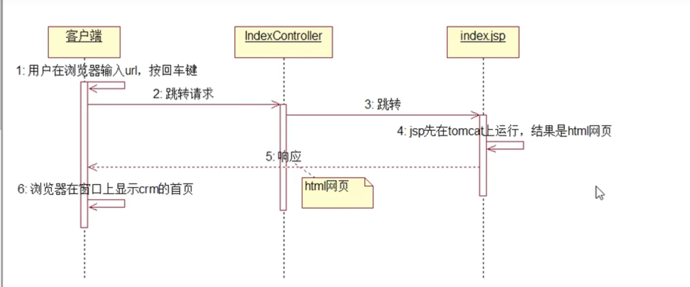

## 21 首页功能实现Controller层

## 22 首页功能实现页面层

## 23 首页功能测试以及由首页跳转到登录页面的分析与设计

## 24 首页跳转到登录页面实现Controller层

## 25 首页跳转到登录页面实现页面层

## 26 登录功能的分析与设计

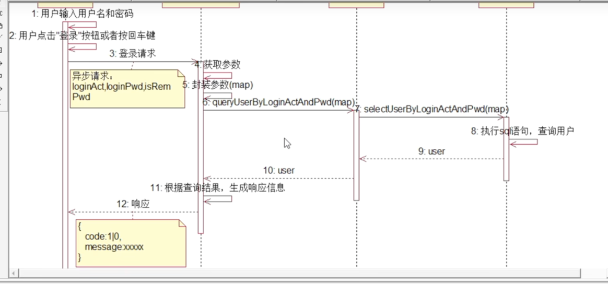

1. 同步请求和异步请求点区别:  
   同步请求: 浏览器窗口发出的请求，响应信息返回浏览器窗口，所以会进行全局刷新。  
   异步请求: ajax发出的请求，响应信息返回到ajax的回调函数，既可以进行全局刷新，也可以进行局部刷新。

   小结: 如果需要进行全局刷新，推荐使用同步请求，当然也可以使用异步请求。  
   如果需要进行局部刷新，只能使用异步请求。  
   如果即可能进行全局刷新，也可能进行局部刷新，也是只能使用异步请求。

2. MyBatis逆向工程:
    1) 简介: 根据表生成mapper层的三部分代码： 实体类，mapper接口，映射文件。
    2) 使用MyBatis逆向工程:
       a) 创建工程: crm-mybatis-generator
       b) 添加插件
        ```xml
       <!-- MyBatis逆向工程插件 -->
       <plugin>
           <groupId>org.mybatis.generator</groupId>
           <artifactId>mybatis-generator</artifactId>
           <version>1.3.2</version>
           <configuration>
               <verbose>true</verbose>
               <overwrite>true</overwrite>
           </configuration>
       </plugin>
        ```
       c) 添加配置文件
        - 数据库连接信息
        - 代码保存的目录
        - 表的信息

       d) 运行MyBatis的逆向工程，根据指定表生成Java代码，保存到指定的目录中。

## 29 登录功能实现Mapper层和Service层

## 30 登录功能实现Controller层

## 31 登录功能实现页面层与优化登录实现代码

3. 使用jQuery获取指定元素的指定属性的值:  
   选择器.attr('属性名'); // 用来获取那些值不是true/false的属性的值  
   选择器.prop('属性名'); // 用来获取值是true/false的属性的值，例如: checked, selected, readonly, disabled等

## 32 登录功能之后业务主页面与名称

- 把控制层(Controller)代码中处理好的数据传递到视图层(jsp)，使用作用域传递:
    - pageContext: 用来在同一个页面的不同标签之间传递数据。
    - request: 在同一个请求过程中间传递数据。
    - session: 同一个浏览器窗口的不同请求之间传递数据。
    - application: 所有用户都共享的数据，并且长久频繁使用的数据。

## 33 实现回车登录

- jQuery的事件函数的用法:
    - 选择器.click(function() { // 给指定的元素添加事件  
      // js 代码  
      });
    - 选择器.click(); // 在指定的元素上模拟发生一次事件

## 34 实现记住密码

- 记住密码:

```plain text
访问: login.jsp --> 后台: .html: 如果上次记住密码，自动填上账号和密码; 否则，删除cookie。  
                如何判断上次是否记住密码?
                -- 上次登录成功，判断是否需要记住密码: 如果需要记住密码，则往浏览器写cookie; 否则，不写。
                            而且cookie的值必须是该用户的loginAct和loginPwd。
                -- 下次登录时，判断该用户有没有cookie: 如果有，则自动填写账号和密码，否则，不写。
                            而且填写的是cookie的值。
    --> 浏览器显示
    
获取cookie:
1. 使用Java代码获取cookie:
    Cookie[] cs = request.getCookies();
    for(Cookie c : cs) {
        if (c.getName().equals("loginAct")) {
            String loginAct = c.getValue();
        } else if (c.getName().equals("loginPwd")) {
            String loingPwd = c.getValue();
        }
    }
    
2. 使用EL表达式获取cookie:
${cookie.loginAct.value}
```

## 36 安全退出功能分析需求与设计

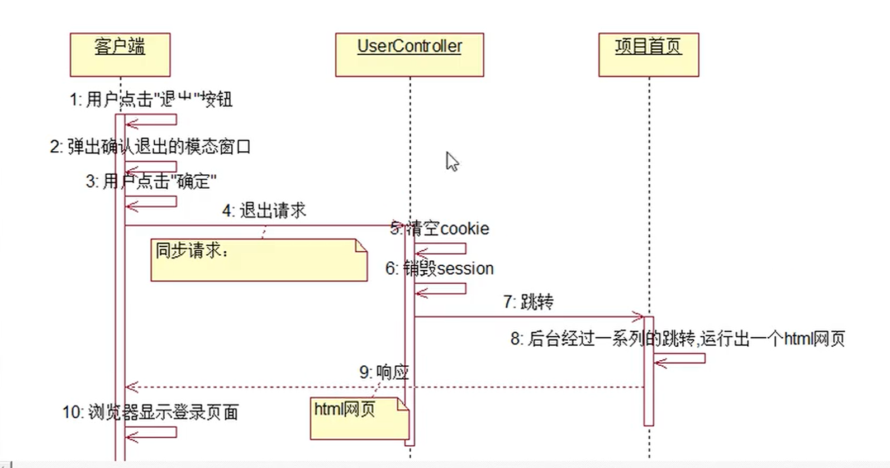

## 37 安全退出功能的实现

## 38 登录验证功能的需求分析

- 用户访问任何业务资源，都需要进行登录验证。
- 只有登录成功的用户才能访问业务资源。
- 没有登录成功的用户访问业务资源，跳转到登录页面。

## 39 登录验证功能实现技术的分析

- 登录验证:

```text
1) 过滤器:
    a) implements Filter {
            -- init
            -- doFilter
            -- destroy
        }
    b) 配置过滤器: web.xml
2) 拦截器:
    a) 提供拦截器类: implements HandlerInterceptor {
                        -- pre
                        -- post
                        -- after
                    }
    b) 配置拦截器: springmvc.xml
```

## 43 测试登录验证功能与分析页面分割技术

```Plain Text
页面切割技术:
    1) <frameset>和<frame>
       <frameset>用来切割页面。
                <frameset cols="20%,60%,20%">
                <frameset rows="10%,80%,10%">
       <frame>: 显示页面。
                <frame src="url">
                
                <frameset cols="20%,60%,20%">
                    <frame src="url1" name="f1">
                    <frame src="url2" name="f2">
                    <frame src="url3" name="f3">
                </frameset>
       每一个<frame>标签就是一个独立的浏览器窗口。
       
       <a href="url" target="f3">test</a>
       
    2) <div>和<iframe>:
       <div>: 切割页面。
            <div style="height: 10%; width: 20%;">
       <iframe>: 显示页面。
            <div style="height: 10%; width: 20%;">
                <iframe href="url">
            </div>
```

## 45 实现点击工作台菜单显示工作台页面与市场活动需求分析

## 46 介绍模态窗口以及使用

```Plain Text
创建市场活动:

模态窗口: 模拟的窗口，本质上是<div>，通过设置z-index大小来实现的。
        初始时，z-index初始参数是<0，所以不显示。
        需要显示时，z-index的值设置成>0即可。
        
        Bootstrap来控制z-index的大小。
        
控制模态窗口的显示与隐藏:
    1) 方式一: 通过data-toggle="modal" data-target="模态窗口的id"
    2) 方式二: 通过js函数控制:
            选择器(选中div).modal("show"); // 显示选中的模态窗口
            选择器(选中div).modal("hide"); // 关闭选中的模态窗口
    3) 方式三: 通过标签的属性data-dismiss=""
            点击添加了data-dismiss=""属性的标签，自动关闭该标签所在的模态窗口。
            
模态窗口的意义:
    window.open("url", "_blank");
    模态窗口本质上就是原来页面中的一个<div>，只有一个页面；所有的操作都是在同一个页面中完成。
```

## 47 设计显示市场活动主页面以及页面后台

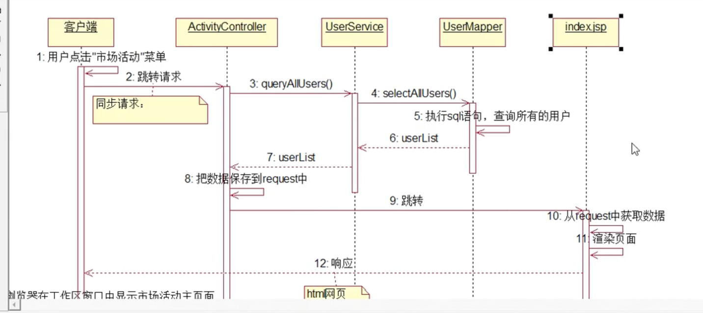

## 48 实现显示市场活动主页面前台页面

## 49 设计保存创建市场活动

## 50 实现保存创建市场活动Mapper层和Service层

## 51 实现保存创建市场活动Controller层

## 52 - 55 实现保存创建市场活动的前台页面并测试

## 56 创建市场活动时重置上次填写的表单数据

## 57 介绍js日历插件及其使用

```Plain Text
1. js日历
    一类问题:
        1) 实现起来比较复杂。
        2) 跟业务无关。
        
    日历插件: Bootstrap-datetimepicker
        前端插件使用步骤:
            1) 引入开发包: .js, .css
                下载开发包，拷贝到项目webapp目录下
                把开发包引入到jsp文件中，<link> <scrip>
            2) 创建容器: <input type="text"> <div>
            3) 当容器加载完成之后，对容器调用工具函数。
```

## 58  59 演示bs_datetimepicker日历插件

## 60 给创建市场活动的画面添加日历功能

## 61 分页查询市场活动需求分析

- 当市场活动主页面加载完成之后，显示所有数据的第一页。
- 用户在市场活动主页面填写查询条件，点击'查询'按钮，显示所有符合条件的数据的第一页。
- 保持每页显示条数不变。
- 实现翻页功能:
    - 在市场活动主页面显示市场活动列表和记录的总条数。
    - 默认每页显示条数: 10。

## 62 分页查询市场活动设计

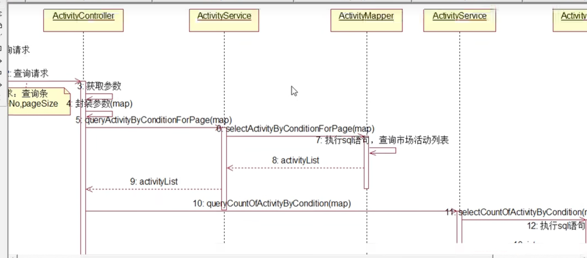

## 63 分页查询市场活动列表实现Mapper层

## 64 分页查询市场活动列表实现Service层

## 65 分页查询市场活动总条数的Mapper层和Service层

## 66 分页查询市场活动列表实现Controller层

## 67 分页查询市场活动前台

```text
在指定的标签中显示jsp页面片段:
选择器.html(jsp页面片段的字符串); // 覆盖显示
选择器.append(jsp页面片段的字符串); // 追加显示
// 其他用法:
选择器.after(jsp页面片段的字符串);
选择器.before(jsp页面片段的字符串);
选择器.text(jsp页面片段的字符串);
```

## 68 分页查询市场活动测试

## 69 实现条件查询市场活动

## 70 回顾上次课内容

## 71 改造分页查询函数

```text
1. 函数: 如果一段用来完成特定功能的代码多次出现，可以封装成函数。
   函数的参数: 在编写函数的过程中，如果有一个或者多个数据无法确定，可以把这些数据定义成函数的参数，将来由函数的调用者来传递参数具体的值。
```

## 72 分析翻页功能的实现

## 73 介绍bs_pagination插件

```text
2. 分页查询插件: bs_pagination

前端插件的使用步骤:
    1. 引入开发包:
    2. 创建容器: <div>
    3. 容器加载完成之后，对容器调用工具函数:
```

## 74 演示bs_pagination插件的使用

## 75 详解bs_pagination插件的参数

## 76 实现市场活动的翻页查询

```text
3. 块元素和行元素:

4. js的系统函数
    1. eval()
    2. parseInt(): 获取小数的整数部分
    
    var str = "var a = 100;"
    eval(str);
    alert(a);
    
5. 演示分页查询市场活动的过程:
    1. queryActivityByConditionForPaging(1, 10)
        |-> 把pageNo，pageSize和查询条件一起发送到后台，查询数据。
        |-> data
            |-> activityList: 遍历list，显示列表
            |-> totalRows: 调用工具函数，显示分页信息
    2. 当用户切换页号或者每页显示条数时: pageNo，pageSize可能会发生改变
        |-> 分页信息自动变化
        |-> 手动刷新列表:
            |-> 把pageNo，pageSize和查询条件一起发送到后台，查询数据
            |-> data
                |-> activityList: 遍历list，显示列表
                |-> totalRows: 调用工具函数，显示分页信息
```

## 77 通过条件查询市场活动时，保持之前选择的[页显示多少条记录]的值

## 78 添加市场活动，保存后，刷新市场活动列表，并保持[每页显示的条数]不变

## 79 删除市场活动需求分析

## 80 删除市场活动设计

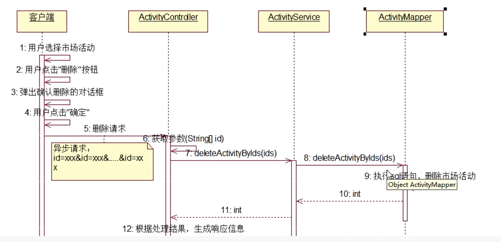

## 81 实现市场活动的全选和取消全选1

## 82 实现市场活动的全选和取消全选2

```text
1. 在页面中给元素添加事件语法:
    1) 使用元素的事件属性: onxxx="f()"
    2) 使用jQuery对象: 选择器.xxx(function() {
                        // js代码
                    });
                    * 只能给固有元素添加事件
                    固有元素: 当调用事件函数给元素添加事件时，如果元素已经生成，则这些元素叫做固有元素。
                    动态生成的元素: 当调用事件函数给元素添加事件时，如果元素还没有生成，后来生成的元素叫做动态生成的元素。
    2) 使用jQuery的on函数: 父选择器.on("事件类型", 子选择器, function() {
                            // js代码
                        });
    
                        父元素: 必须是固有元素，可以是直接父元素，也可以是间接父元素。
                              原则: 固有父元素的范围越小越好。
                        事件类型: 跟事件属性和事件函数一一对应。
                        子选择器: 目标元素，跟父选择器构成一个父子选择器。
                        * 不仅能给固有元素添加事件，还能够给动态生成的元素添加事件。
```

## 83 实现市场活动的全选和取消全选3

## 84 实现市场活动的全选和取消全选4

```text
每次重新获取市场活动列表数据时，需要将全选复选框的状态设置为未选状态。
```

## 85 回顾市场市场活动流程

## 86 删除市场活动实现Mapper层和Service层

## 87 删除市场活动实现Controller层

## 88 删除市场活动实现前台页面

```text
2. js中截取字符串:
    str.substr(startIndex, length); // 从下标startIndex的字符开始截取，截取length个字符
    str.substring(startIndex, endIndex); // 从下标startIndex的字符开始截取，截取到下标是endIndex到字符
    var str = "beijing";
    str.substr(2, 3); // iji
    str.substring(2, 4); // ij
    
3. ajax向后台发送请求时，可以通过data提交参数，data到数据格式有三种:
    1) data: {
            k1: v1,
            k2: v2,
            k2: v22, // 这种方式不能提交同名的key
            ...
        }
        * 劣势: 只能向后台提交一个参数名对应一个参数值的数据。
            不能向后台提交一个参数名对应多个参数值的数据。
            只能向后台提交字符串数据。
          优势: 操作简单。
    2) data: k1=v1&k2=v2&...
        * 优势: 既能向后台提交一个参数名对应一个参数值的数据。
            也能向后台提交一个参数名对应多个参数值的数据。
          劣势: 操作麻烦。
               只能向后台提交字符串数据。
    3) data: FormData对象
        * 优势: 不仅能提交字符串数据，还能提交二进制数据。
          劣势: 操作更麻烦。
```

## 89 修改市场活动需求分析


## 90 修改市场活动设计

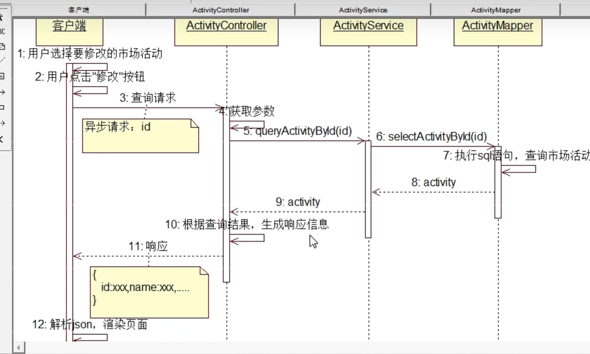

## 91 修改市场活动实现Mapper层和Service层

## 92 修改市场活动实现Controller层

## 93 修改市场活动实现前台页面

## 94 设计保存修改的市场活动

```text
1. 封装参数:
    1) 如果做查询条件，或者参数之间不是属于一个实体类对象，封装成Map。
    2) 如果做写数据，并且参数就是属于一个实体类对象，封装成实体对象。
```

## 95 实现保存修改的市场活动的Mapper层和Service层

## 96 实现保存修改的市场活动的Controller层

## 97 实现保存修改的市场活动的前台页面

```text
2. 使用jQuery获取或设置元素的value属性值:
    获取: 选择器.val();
    设置: 选择器.val(属性值);
```

## 98 测试保存修改的市场活动

## 99 分析导出市场活动的应用场景

## 100 导出市场活动的需求分析


## 101 分析导出市场活动的实现

```text
3. 导出市场活动
    1) 给"批量导出"按钮添加单击事件，发送导出请求。
    2) 查询所有的市场活动。
    3) 创建一个excel文件，并且把市场活动写到excel文件中。
    4) 把生成的excel文件输出到浏览器(文件下载)。
```

## 102 介绍apache-poi插件

## 103 介绍apache-poi插件的使用

## 104 演示使用apache-poi生成excel文件

## 105 使用apache-poi修饰excel文件效果

## 106 演示文件下载

## 107 测试文件下载功能

```text
技术准备:
    1) 使用Java生成excel文件: iText, apache-POI
        关于办公文档插件使用的基本思想: 把办公文档的所有元素都封装成普通的Java类，开发人员通过操作这些类达到操作办公文档的目的。
            
        文件 ------------- HSSFWorkbook
        页 ------------- HSSFSheet
        行 ------------- HSSFRow
        列 ------------- HSSFCell
        样式 ------------- HSSFCellStyle
        
        使用apache-poi生成excel:
            a) 添加依赖:
                <dependency>
                    <groupId>org.apache.poi</groupId>
                    <artifactId>poi</artifactId>
                    <version>3.15</version>
                </dependency>
            b) 使用封装类生成excel文件:
        
    2) 文件下载:
    file_download_test.jsp
    ActivityController
        |->fileDownload()
        
    * 所有文件下载的请求只能是同步的。
```

## 108 设计导出市场活动

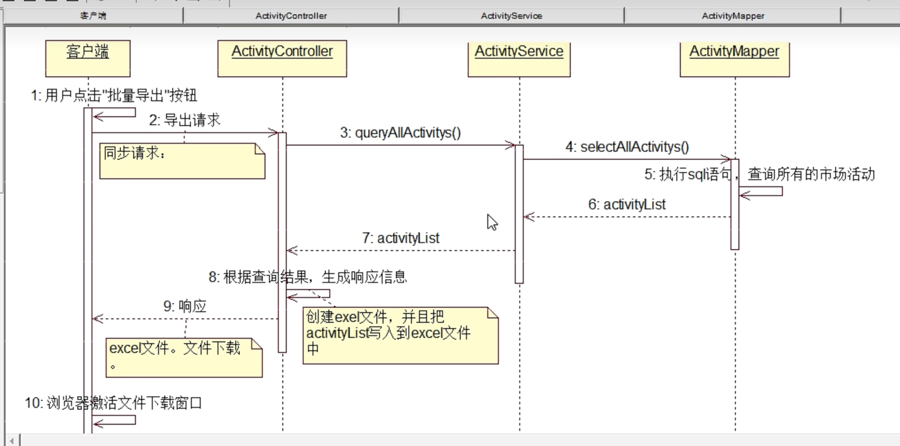

## 109 实现导出市场活动的Mapper层和Service层

## 110 实现导出市场活动的Controller层1

```text
将查询出的市场活动列表数据写入到excel文件中
```

## 111 实现导出市场活动的Controller层2

```text
将内存中的excel文件写到指定路径中
```

## 112 实现导出市场活动的Controller层3

```text
实现文件下载
```

## 113 实现导出市场活动的前台页面

## 114 测试导出市场活动

## 115 优化导出市场活动

## 116 分析选择导出市场活动

## 117 导入市场活动的需求分析

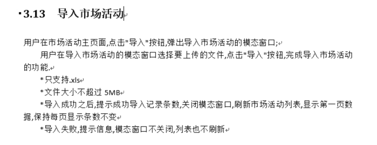

## 118 分析导入市场活动的实现

## 120 演示文件上传2

## 121 演示文件上传3

## 122 演示文件上传4

## 123 演示使用apache-poi解析excel文件

```text
1. 导入市场活动

    1) 把用户计算机上的excel文件上传到服务器(文件上传)。
    2) 使用Java解析excel文件，获取excel文件中的数据。
    3) 把解析出来的数据添加到数据库中。
    4) 返回响应信息。
    
    技术准备:
        1) 文件上传
            file_upload_test.jsp
            ActivityController
                |->fileUpload()
        2) 使用Java解析excel文件: iText, apache-poi
```

## 124 设计导入市场活动并实现Mapper层和Service层

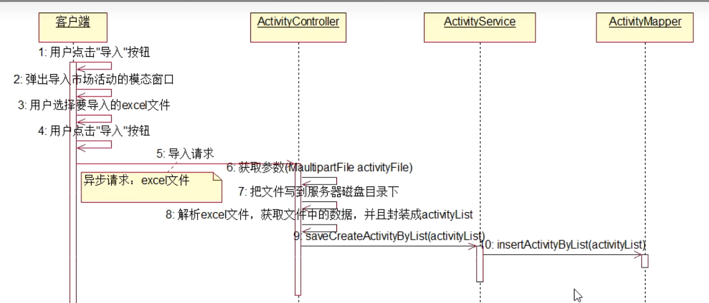

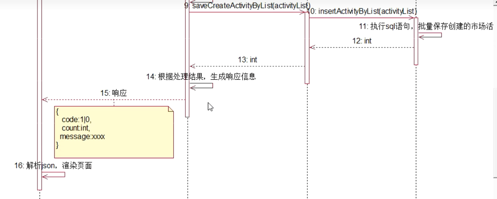

## 125 实现导入市场活动的Controller层

```text
1. 文件上传: 上传的文件是跟用户约定好的。
```

## 126 实现导入市场活动的前台页面

```text
2. js截取字符串:
    str.substr(startIndex, length)
    str.substr(startIndex) // 从下标为startIndex的字符串开始截取，截取到字符串最后
    str.substring(startIndex, endIndex)
```


